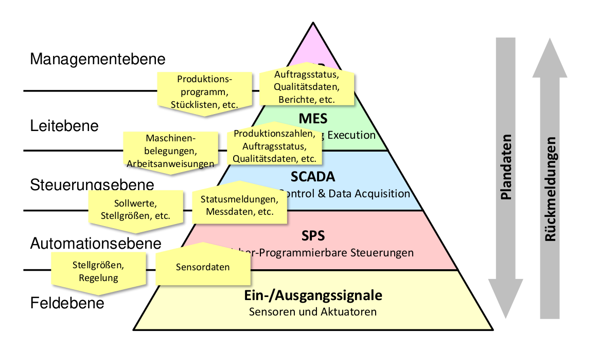
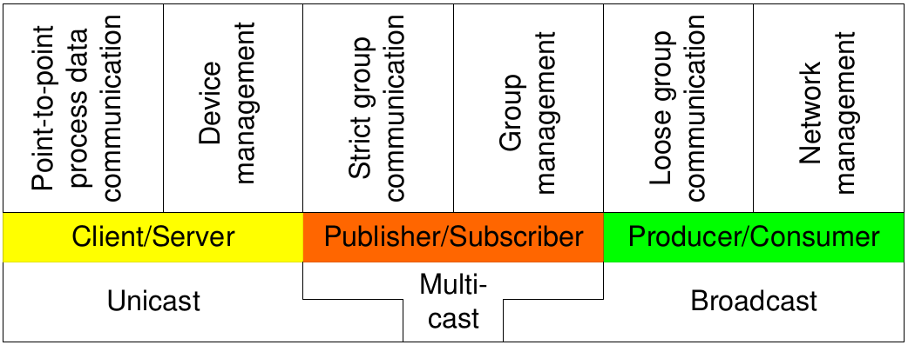
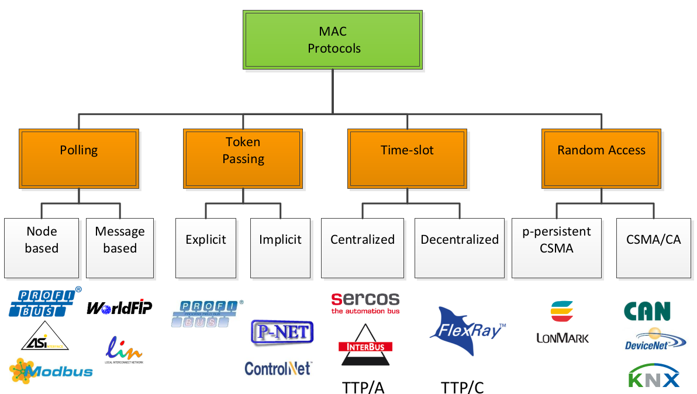
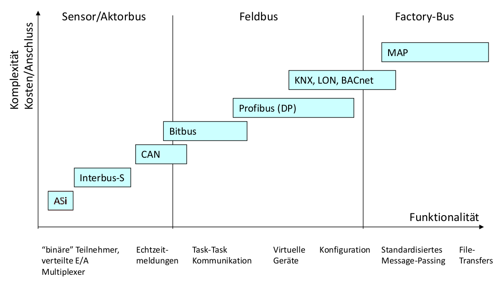

# Grundlagen

## Industrie 4.0

* Prinzipien
	* Vernetzung
	* Informationstransparenz
	* Technische Assistenz
	* Dezentrale Entscheidungen
	* Intelligente Wertschöpfungsketten
	* Ganzen Lebenszyklus von Produkt berücksichtigen
* Herausforderungen
	* Kommunikation
	* Informationssicherheit
	
## Automationspyramide

## Kommunikationsparadigma

## Redundanz

\begin{multicols}{2}
	\begin{figure}
		\centering
		\includegraphics[height=0.4\textheight]{./img/dezaut_basics_cold_standby.png}
		\caption{Cold/Dynamic Standby}
	\end{figure}

	\columnbreak

	\begin{figure}
		\centering
		\includegraphics[height=0.4\textheight, trim={0 0 0 1.5mm}, clip]{./img/dezaut_basics_hot_standby.png}
		\caption{Hot/Static Standby}
	\end{figure}
\end{multicols}

## Evolution von Feldgeräten

#. Zuerst nur Signal-Detektion (am Ausgang des Sensors) und Skalierung; Ausgabe analog (z.B. 4-20 mA)
#. Dann Justier- und Bedienparameter; Skalierung im Digitalen Bereich; Ausgabe analog
#. Ausgabe digital über Kommunikationskontroller und Bussystem

## Standards (Übersicht)

* IEC 61158: Kommunikationsprofile für Feldbussysteme (aus Anwender- und Entwicklersicht)
* IEC 61784: In Kombination mit IEC 61158; left fest, wie Profile kombiniert werden können
* VDI/VDE 2184: "Reliable operation and maintenance of fieldbus systems"; Gegenmaßnahmen für Fehler in Feldbusysemen
* IEC 61508: "Functional safety of electrical/electronic/programmable electronic safety-related systems"; legt SILs fest
* IEC 61131: Normierung von SPSs
* IEC 61131-3: Systemmodell für SPS: Konfiguration, Ressourcen, Programme, Funktionsblöcke
* IEC 61499: Weiterenwicklung von Funktionsblöcken (mit Ereigisschnittstellen)

## Standards (Übersicht) (cntd.)

* EN 50 170: ProfiBus in seinen diversen Profilen (FMS, DP, PA)
* EIA-485: darstellung von logisch 0 und 1 durch Spannungsdifferenz zwischen zwei Leitungen
* IEEE 802.11: Wifi, 802.11p for automotive
* IEEE 802.15.4: standardisierter Physical und Data-Link-Layer für drahtlose Verbindungen

## Näherungssensoren

* Optisch: Einweg oder Reflex, mit oder ohne Lichtwellenleiter
* Induktiv: Hochfrequenter Schwingkreis, Magnetfeld der Spule dring nach außen, veränderte Induktivität führt zu veränderter Schwingfrequenz
* Kapazitiv: analog zu induktiv, aber es können alle Materialien erkannt werden, mit anderer Dielektrizitätskonstante als Luft
* Magnetisch:
	* Reed-Schalter: Magnetfeld schließt oder öffnet Metallzungen, bisschen wie mechanischer Schalter
	* Hall-Detektoren: Magnetfeld bewirkt messbare Spannung

## SPS

* CPU ist auf Betriebssicherheit ausgelegt &rarr; Watchdogs und Parity-Checker
* Programm arbeitet in Zyklen um Echtzeitfähigkeit zu garantieren
* Während Zyklus konstantes Prozessabbild
* Worst-Case Reaktionszeit: $t_R = 2\cdot(t_Z + t_E + t_A)$

## IEC 61131-3 System-Modell

* Einteilung hierarchisch in Konfiguration, Ressourcen, Programme und Funktionsblöcke (und Tasks zur Steuerung von Programmen)
* Datentypen und -formate
* Programmiersprachen: Anweisungsliste, Kontaktplan, Funktionsplan, Strukturierter Text (, Ablaufsprache)
* Standardfunktionsblöcke

## IEC 61499 Funktionsblöcke

* Weiterentwicklung des Funktionsblockprinzips aus IEC 61131-3
* Neben Dateninterface auch Ereignisinterface
* Daten werden mit Ereignissen verknüpft
* Execution Control Chart
* Service Interface Function Blocks, Aktionen können applikations- oder ressourceninitiiert sein
* Soll erleichtern, Intelligenz weiter auf einzelne Knoten aufzuteilen

# Kommunikationssysteme

## Übersicht

## Übersicht (cntd.)

## ASi

* OSI-Layer 1:
	* ungeschirmte und unverdrillte Zweidrahtleitung in typischem, gelben Mantel (sowohl Daten als auch Energie), IP 67
	* freie Topologie
	* MAN-codierte Bitfolge (gleichstromfrei) wird mittels alternating pulses ($sin^2$-förmig) übertragen (geringe Bandbreite)
* OSI-Layer 2:
	* Single-Master-System mit Zyklischem Polling (jeweils 4 Bit pro Zyklus in beide Richtungen)
	* Zykluszeit von Teilnehmeranzahl abhängig
	* Unterschiedliche Nachrichtenarten für Prozessdatenaustausch/Parametrierung/Reset/etc.

## ASi (cntd.)

* Datensicherung:
	* Start-/Stopbit
	* Alternation der Pulse
	* Paritätsbit
	* Aufruflänge
* Analogwertübertragung (16 Bit) über 8 Zyklen hinwe
* In Managementphase auch azyklische Nachrichten
* In jedem Zyklus wird nach neuen Teilnehmern gesucht
* ASi-Safety-at-Work: SIL 3 durch Safety-Slaves und Safety-Monitor: Schaltet bei Fehler Strom ab

## ProfiBus

* Drei wichtige Ausprägungen:
	* FMS: Field Message Specification
	* DP: Dezentrale Peripherie
	* PA: Prozessautomatisierung
* FMS und DP teilen sich OSI Schichten 1 und 2:
	* OSI 1: Lichtwellenleiter oder EIA-485 (RS-485)
	* OSI 2: Fieldbus Data Link: Multi-Master-Slave-System, Master reichen Token weiter
* Unterschiedliche Dienste: Send (and request) data with/without acknowledge and with/without (multicast) reply
* Topologie: ausschließlich linienförmig aber mit Repeatern um um mehrere Linien zu koppeln
* Übertragung:
	* EIA 485
	* UART-Character
	* Non Return to Zero

## ProfiBus (cntd.)

* Einfaches Einfügen von neuen Mastern in Token-Ring
* Service Access Points:
	* Bei FMS zur Trennung unterschiedlicher logischer Verbindungen
	* Bei DP um unterschiedliche Funktionen anzusteuern (quasi wie OP-Code)
* 3 Geräteklassen: DP-Master 1 (wie SPS), DP-Master 2 (für Management), DP-Slave
* Zur einheitlichen Integration von Feldgeräten:
	* Electronic Device Sheets
	* oder Feldgerätetreiber (Device Type Manager)

## ProfiNet

* 3 Ausprägungen:
	* Best Effort: auf TCP/IP-Basis
	* Soft Real Time: Priorisierung von RT-Nachrichten
	* Isochronous Real Time: Scheduler wird zwischen Ethernet und TCP/IP geschalten
* Topologie recht frei (ebenw wie bei Ethernet)
* Robustere Steckverbindungen als bei üblichem Ethernet, IP 67
* Für Soft Real Time wird Ethernet-Protokoll abgespeckt um Overhead zu verhindern
* Geräterollen wie bei ProfiBus
	* IO-Controller ist wie DP-Master 1
	* IO-Supervisor ist wie DP-Master 2
	* IO-Device ist wie DP-Slave
* Kompaktgeräte und modulare Geräte mit Slots und Subslots
* IO-Data-Objects und Alarm-Data-Objects können über RT-Kanal ausgetauscht werden

## CAN (Controller Area Network)

* Topologie linienförmig
* Multi-Master-System mit *Nachrichten*-orientiertem Protokoll
* CSMA/CA: Arbitrierung mittels rezessiven/dominanten Bits Nachrichten-ID
* Telegrammarten für Daten, Datenanforderung, Fehler und Überlast
* Hohe Datensicherheit durch CRC und Acknowledgements
* Fehlereinschränkung: Wenn zu viele Fehlertelegramme generiert werden, wird Knoten zuerst in fehlerpassiven Modus geschoben und kann sogar vom Bus entfernt werden.

## TT-CAN

* klassisches CAN bietet keine Echtzeitfähigkeit
* Echtzeitfähigkeit durch static scheduling
* Zwei Phasen: exklusive Phase und konkurrierende Phase mit Arbitrierung

## LIN

* Datenübertragung über eine einzige Leitung &rarr; kostengünstig
* Half-Duplex (notwendigerweise)
* One Master, Multiple Slaves
* Sicherungsschicht (Checksumme)
* Tool Chain:
	* Node Capability File (ähnlich zu EDD in ProfiBus)
	* LIN Description File beschreibt Kommunikationsbeziehungen und Schedule
	* Generator erstellt Software für alle Knoten aus NCF und LDF
	* LIN API

## FlexRay

* Hohe Datenrate
* Hoher Determinismus &rarr; gute Echtzeitfähigkeit
* weitgehend freie Topologie
* Fehlereindämmung auf Bitübertragungsebene
* Knotenaufbau:
	* Host
	* Communication Controller implementiert Protokoll
	* Bus-Driver übersetzt Signal auf Medium
	* **Bus-Guardian** verhindert Babbling Idiot
* wie üblich, statisches und dynamisches Segment pro Zyklus
* CRC zur Datensicherung

## CIP (Common Industrial Protocol)

* Einheitlicher Application-Layer für die Ausprägungen: Ethernet/Industrial Protocol, ControlNet und DeviceNet
* Objektorientiert, Objekte stellen gemeinsames Vokabular dar
* Kommunikation über Connection-Objects
* Assembly-Objekte als Multiplexer/Demultiplexer

## CIP (Common Industrial Protocol) (cntd.)

* DeviceNet
	* basiert auf klassischem CAN
	* unterschiedliche Verbindungsarten: Polling, Explicit, Bit-Strobed, Change of State, Cyclic
* ControllNet
	* Concurrent Time-Division Multiple Access
	* implizites Token-Verfaren
	* in zyklischer Phase darf jeder Teilnehmer genau einmal Senden
	* in azyklischer Phase beginnt jedes Mal der nächste (impliziter Token) und round-robin
* Ethernet/IP (Industrial Protocol)
	* basiert auf switched Ethernet
	* hat TCP- und UDP-basierte Features

## InterBus

* Bussystem mit abzweigenden Stichleitungen (Fernbus, Lokalbus, Loop)
* Datenring mit Master-Slave-Verfahren, **Summenrahmenprotokoll** &rarr; sehr hohe Effizienz, Echtzeitfähigkeit
* Topologie: Ring (damit Summenrahmenprotokoll funktioniert)
* Fernbus für Überwindung großer Distanzen (wieder mittels EIA 485)
* Teilnehmer haben Eingangs-, Ausgangs-, Identifikations- und und Control-Register, die zu großem Shift-Register zusammengeschlossen werden können
* Master schiebt zuerst Loop-Back-Wort in Ring und dann solange Steuerworte bis er wieder Loop-Back-Wort erhält. Dann hat er alle IDs

## InterBus (cntd.)

* Daten- und Identifikationszyklus, in beiden Zyklen sowohl Daten- als auch CRC-Sequenz
* Signale: Bustakt, Datensignal, Select (Daten/ID-Zyklus), Control (Daten-/CRC-Sequenz), Reset
* Datensicherheit durch Loop-Back-Wort-Check, CRC und Timeout-Kontrollen
* Funktionale Sicherheit durch VDI/VDE 2184 und "Black Channel"-Prinzip
* InterBus kann über TCP/IP getunnelt werden oder auch in ProfiNet eingebettet werden:
	* enweder ist jedes Feldgerät dann ein eigenes virtuelles Gerät
	* oder man fasst alle Feldgeräte zu einem virtuellen Gerät mit einem Modul zusammen
	* oder alle Feldgeräte zu einem virtuellen Gerät aber separate Module

## KNX

* Automations- und Feldfuntionen integriert (Management eher weniger)
* Einheitliches Konfigurationstool
* 3 Ebenen: Backbone, Hauptlinien und Sublinien
* Adressierung über individuelle oder über Gruppenadresse
* Für Kontrolldaten Publish/Subscribe, für Engineering-Daten 
* Bus-Coupling-Unit für Anbindung an Bus
* Interoperabilität durch Klassifikation von Daten nach mehreren Kriterien:
	* Anwendungsbereich, Anwendungsmodell, Funktionsblock, Datenpunkt, Datenpunktyp

## LonWorks

* 3 Bestandteile
	* LonTalk: das Protokoll
	* Neuron-Chip: implementiert LonTalk
	* Network-Management-Tool
* Arbeitet über **Netzwerkvariablen**

## IEEE 802.15.4

* Standardisierung von Schicht 1 und 2 für drahtlose Verbindungen für die Automatisierung
* fixe Frequenzbänder (kein Frequency-Hopping)
* CSMA/CA
* guaranteed time slots (but they don't guarantee)
* low power consumption
* Full-Function- vs. Reduced-Function-Devices	
* Beacon enabled or disabled (beacons synchronize network)
* contention period and contention-free period (which only shapes traffic but does not guarantee RT)
* provides primitives for security
