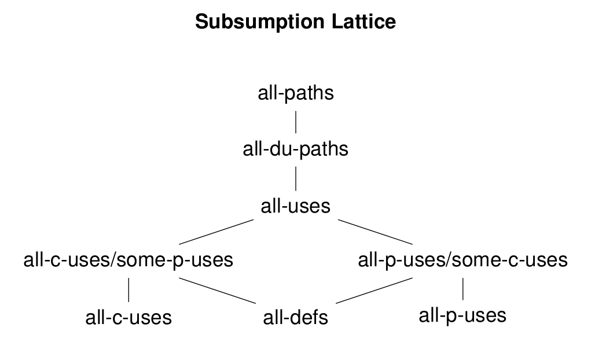
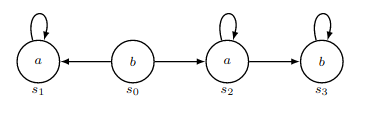
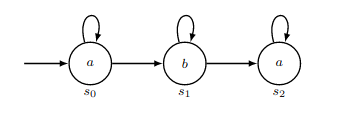

title: "**Zusammenfassung: Programm- und Systemverifikation**"
lang: en-GB
...

---

An dieser Zusammenfassung und der zugehörigen Formelsammlung kann gerne auf [Github](https://github.com/cornhead/zusammenfassungen.git) mitgewirkt werden!

---

* Fault: cause of an error
* Error: erroneous state, but not directly observable in behaviour $\rightarrow$ might lead to failure, but not necessarily
* Failure: deviation from expected behaviour

# Coverage

Coverage criteria state when enough testing has been done.

## Control Flow Based Coverage Criteria

### Path Coverage

Execute every path the program could take at least once.

Easy counter example to see that path coverage has not been reached are loops: every new loop iteration constitutes a new path and all paths have to be taken. Path coverage is generally not always reachable, e.g., it es not achievable for the [following program](#inf_loop):

~~~ {#inf_loop .c .number-lines}
while (1) {
	if ( getchar () == EOF )
	break ;
}
~~~

### Statement Coverage

Execute every statement of the program (merely syntactic) at least once.

Statement Coverage is implied by path coverage. Hence, if statement coverage can't be achieved, path coverage can't be achieved either. On the other hand, if path coverage can't be achieved for a given program, statement coverage still can be reached, as is the case in [above program](#inf_loop).

If for a given program statement coverage can't be achieved, it is said to contain unreachable code:

~~~ {.c .number-lines}
if (false){
	...
}
~~~

### Branch Coverage

Execute every branch at least once.

In literature, the definitions of branches are rather imprecise $\rightarrow$ what about unconditional jumps, `goto`, function calls or fall-throughs?

### Condition Coverage

Exercise every boolean sub-expression/atom/condition outcome (but their values do not necessarily have to affect the overall outcome)

Condition coverage does not imply descision coverage, as can be seen by the following program, with the test cases $\{x=5, y=-3\}$ and $\{x=-1, y=2\}$

~~~ {.c .number-lines}
if ( ( x > 0) && ( y > 0) )
	x++;
~~~

All outcomes of the sub-expressions are exercised once but the decision never evaluated to `true`.

### Modified Condition / Decision Coverage (MC/DC)

Every condition in a decision has to have taken affect on the outcome at least once. (see the stuck-at error model in the lecture on digital design)

MC/DC is defined in DO-178B (high relevance in industry)

### Multiple Condition Coverage

For $n$ sub-conditions in a decision, try all $2^n$ combinations.

## Data Flow Based Coverage Criteria

* Definitions: assignment of a value to a variable
* Use: statement where the value of a variable is read
	* C(omputation)-Use: defines/computes other variables
	* P(redicate)-Use:  within conditional statements

------------------------------------------------------------------------
                  Name         Criteria
----------------------         -------------------------------------------------------------
              all-defs         all definitions get used at some point

            all-c-uses         one path from a definition to each c-use that is affected by that definition

            all-p-uses         one path from a definition to each p-use that is affected by that definition

all-c-uses/some-p-uses         same as all-c-uses, but if there are no c-uses, than at least one affected p-use needs to be triggered

all-p-uses/some-c-uses         same as all-p-uses, but if there are no c-uses, than at least one affected c-use needs to be triggered

              all-uses         all-c-uses and all-p-uses $\rightarrow$ all uses need to be executed

          all-du-paths         same as all-uses, but all possible du paths have to be taken at least once, not just one path
------------------------------------------------------------------------

Table: Data Flow Criteria

{width=75%}

## Mutation Testing

# Automated Test Case Generation

# Examples

## Coverage

\pagebreak

### Example 1, taken from the exam in June 2016

Consider the following program fragment and test suite:

~~~ {.c .number-lines}
int maxsum (int max, int val){
	int result = 0;
	int i = 0;								//	     Test Suite
	if (val < 0)							//	--------------------
		val = -val;							//	 max   val   result
	while ((i < val) && (result <= max)){	//	----- ----- --------
		i = i+1;							//	  0     0      0
		result = result + i;				//	  0    -1      0
	}										//	 10     1      1
	if (result <= max)						//	--------------------
		return result;
	else
		return max;
}
~~~

#### A) Control flow based criteria

Indicate (X) which of the following coverage criteria are satisfied by the test-suite above (assume that the term “decision” refers to all non-constant Boolean expressions in theprogram).

---------------------------------------------
                   Criterion     Satisfied     Not Satisfied
----------------------------    -----------   ---------------
               path coverage                         X

          statement coverage        X

             branch coverage        X

           decision coverage        X

 condition/decision coverage        X
----------------------------------------------

#### B) Data flow based criteria

Indicate (X) which of the following coverage criteria are satisfied by the test-suite above(here, the  parameters of the function do not constitute definitions, and the return statements are c-uses)

---------------------------------------------
                  Criterion     Satisfied     Not Satisfied
---------------------------    -----------   ---------------
                   all-defs         X
                   
                 all-c-uses         X
                 
                 all-p-uses         X
                 
     all-c-uses/some-p-uses         X
     
     all-p-uses/some-c-uses         X
----------------------------------------------

\pagebreak

### Example 2, taken from the exam in June 2017

Consider the following program fragment and test suite:

~~~ {.c .number-lines}
bool prime (unsigned n){
	bool result = true;				//	  Test Suite
	unsigned i = 2;					//	---------------
	while ((i != n) && result){		//	 n     result
		if (n % i == 0)				//	----   ------
			result = false;			//	 0     false
		else						//	 3     true
			i = i + 1;				//	 42    false
	}								//	---------------
	return result;
}
~~~

#### A) Control flow based criteria

Indicate (X) which of the following coverage criteria are satisfied by the test-suite above (assume that the term “decision” refers to all non-constant Boolean expressions in theprogram).

---------------------------------------------
                   Criterion     Satisfied     Not Satisfied
----------------------------    -----------   ---------------
               path coverage                         X

          statement coverage        X

             branch coverage        X

           decision coverage        X

 condition/decision coverage        X
----------------------------------------------

#### B) Data flow based criteria

Indicate (X) which of the following coverage criteria are satisfied by the test-suite above(here, the  parameters of the function do not constitute definitions, and the return statements are c-uses)

---------------------------------------------
                  Criterion     Satisfied     Not Satisfied
---------------------------    -----------   ---------------
                   all-defs         X
                   
                 all-c-uses                         X
                 
                 all-p-uses         X
                 
     all-c-uses/some-p-uses                         X
     
     all-p-uses/some-c-uses         X
----------------------------------------------

\pagebreak

### Example 3, taken from the exam in June 2018

Consider the following program fragment and test suite

~~~ {.c .number-lines}
bool range_check (unsigned m, unsigned n){
	if (m > n){
		unsigned t = m;					//	  Test Suite
		m = n;							//	---------------
		n = t;							//	 m   n   result
	}									//	--- ---  ------
	bool result = false;				//	 3   7   true
	bool tmp = true;					//	 1   0   false
	unsigned i = m;						//	 2   5   true
	while ((i > 0) && (i < n)){			//	---------------
		i = i + 1;
		if (i % m == 0)
			result = result || tmp;
	}
	return result;
}
~~~

#### A) Control flow based criteria

Indicate (X) which of the following coverage criteria are satisfied by the test-suite above (assume that the term “decision” refers to all non-constant Boolean expressions in theprogram).

---------------------------------------------
                            Criterion     Satisfied     Not Satisfied
-------------------------------------    -----------   ---------------
                   statement coverage         X

                      branch coverage         X

                    decision coverage         X

 modified condition/decision coverage         ?
---------------------------------------------

#### B) Data flow based criteria

Indicate (X) which of the following coverage criteria are satisfied by the test-suite above (here, the parameters of the function do not constitute definitions, and the return statements are c-uses).

---------------------------------------------
                  Criterion     Satisfied     Not Satisfied
---------------------------    -----------   ---------------
                   all-defs         X
                   
                 all-c-uses                         X
                 
                 all-p-uses         X
                 
     all-c-uses/some-p-uses                         X
     
     all-p-uses/some-c-uses                         X
----------------------------------------------

#### C) not given here

#### D) MC/DC

Consider the expression $((a \wedge b) \vee c)$, where $a$, $b$, and $c$ are Boolean variables. Provide a minimal number of test cases such that modified condition/decision coverage is achieved for the expression. Clarify for each test case whichcondition(s) independently affect(s)the outcome.

---------------------
 a b c  (a && b) || c
 - - - ---------------
 0 1 0       0

 1 1 0       1

 1 0 0       0

 0 0 1       1
---------------------

\pagebreak

## Hoare-Logic

### Example 1, taken from the exam in June 2016

Prove the Hoare Triple below (assume that the domain of all variables in the programare the natural numbers including 0, i.e., $x,y \in \mathbb{N}_0$ or, equivalently, both $x$ and $y$ are of type `unsigned`).  You need to find a sufficiently strong loop invariant. Annotate the following code directly with the required assertions. Justify each assertion by stating which Hoare rule you used to derive it, and the premise(s) of that rule.  Ifyou strengthen or weaken conditions, explain your reasoning

~~~ {.c .number-lines}
{true}

assert true; // if-then-else-rule

if (x > y){
	assert x > y && true; // strengthening
	assert y <= x+1; // assignment rule
	t := x;
	assert y <= t+1; // assignment rule
	x := y;
	assert x <= t+1; // assignment rule
	y := t;
	assert x <= y+1; // if-then-else rule
}
else{
	assert !(x > y) && true; // non-existing assignment + strenthening
	skip;
	assert x <= y+1; // if-then-else rule
}

assert x <= y+1; // loop rule

while (x < y){
	assert x < y; // strengthening (actually, it's equivalent),
	              // also it's implied by loop condition => induction step
	assert x+1 <= y; // assignment rule
	x := x + 1;
	assert x <= y; // assignment rule
	y := y - 1;
	assert x <= y+1; // invariant
}
assert !(x < y) && x <= y+1; // loop rule
assert (x-y) <= 1; // weakening (actually, it's the same)
{x-y<=1}
~~~

\pagebreak

### Example 2, taken from the exam in June 2018

Prove the Hoare Triple below (assume that the domain of all variables in the program are the unsigned integers including zero, i.e., $x,y,n,m \in \mathbb{N}\cup\{0\}$).  You need to find a sufficiently strong loop invariant. \linebreak
*Hint*: you will need an expression that represents how often the loop has been executed.

~~~ {.c .number-lines}
{true}
assert true; // strengthening
assert 0 == 0 && n == n; // assignment rule
x := n;
assert 0 == 0 && x == n; // assignment rule
y := 0;
assert y == 0 && x == n; // if-then-else rule
if (m != 0){
	assert m != 0 && y == 0 && x == n; // strengthening
	assert y == (n-x)*m; // loop rule
	while (x != 0){
		assert y+m == (n-x+1)*m; // assignment rule,
		                         // implied by invariant => inductiveness
		x = x - 1;
		assert y+m == (n-x)*m; // assignment rule
		y = y + m;
		assert y == (n-x)*m; // invariant
	}
	assert x == 0 && y == (n-x)*m; // strengthening / loop rule
	assert y == n*m; // if-then-else rule
}
else{
	assert m == 0 && y == 0 && x == n; // strengthening
	skip;
	assert y == n*m; // if-then-else rule
}

assert y == n*m;
{y=n*m}
~~~

\pagebreak

## Satisfiability

### Example 1, taken from the exam in June 2016
Check the satisfiability of the following SMT formulas. Assume that $x,y,z,a,b,c \in \mathbb{Z}$ are integer constants, and $f:\mathbb{Z}\times\mathbb{Z}\rightarrow\mathbb{Z}$ and $g:\mathbb{Z}\rightarrow\mathbb{Z}$ are binary and unary uninterpreted functions over integers respectively. Whenever a formula is satisfiable, give a satisfyingassignment for it, i.e., integer values for all variables and function interpretations overintegers that make the formula true under the assignment.  Whenever a formula is notsatisfiable, give a reason why it is unsatisfiable.

--------------------------------------
                                                                 formula    SAT
------------------------------------------------------------------------    -----------------------------------
$f(3,y) = 6 \wedge f(y,x) = f(x,y) \linebreak                               yes
\wedge f(y,4) = 8 \wedge f(y,y) = 4$ \linebreak

$f(1,x) = 3 \wedge f(1,x) = f(x,1) \linebreak                               no, \linebreak
\wedge g(x) = f(1,x) \wedge g(g(g(1))) = 1 \linebreak                       $g(x)=1$ $\lightning$ $g(x)=3$ 
\wedge g(g(1))6 = f(x,1) \wedge x = g(g(1))$ \linebreak

$f(x,x) =x \wedge f(y,y) =y \wedge a6=b \wedge f(x,y) =f(y,x) \linebreak    yes
\wedge f(0,1) =a \wedge f(1,0) =b \wedge (f(x,x) = 0 \linebreak
 \vee f(x,x) = 1) \wedge (f(y,y) = 0 \vee f(y,y) = 1)$ \linebreak
--------------------------------------

\pagebreak

## Temporal Logic

### Example 1, taken from the exam in June 2016

Consider the following Kripke Structure:

{width=60%}

For each formula,  give the states of the Kripke structure for which the formula holds. In other words, consider the computation trees starting with one of the states from the set $\{s_0, s_1, s_2, s_3\}$, and for each tree, check whether the given formula holds on it or not.

---------------------------
           formula     states in which it holds
------------------     ------------------------
    $b \wedge AXa$     $\{s_0\}$

      $a \vee AXb$     $\{s_1, s_2, s_3\}$

$AFAGa \vee AFAGb$     $\{s_0, s_1, s_2, s_3\}$

      $EFG \neg b$     $\{s_0, s_1, s_2\}$

             $AGa$     $\{s_1\}$
----------------------------

\pagebreak

### Example 2, taken from the exam in June 2018

Consider the following Kripke Structure:

{width=60%}

For each formula, give the states of the Kripke structure for which the formula holds. In other words, for each of the states from the set $\{s_0, s_1, s_2\}$, consider the computation trees starting at that state, and for each tree, check whether the given formula holds on it or not.

---------------------------
           formula     states in which it holds
------------------     ------------------------
             $AXa$     $\{s_2\}$

             $EXa$     $\{s_0, s_1, s_2\}$

             $AFb$     $\{s_1\}$

             $EGa$     $\{s_0, s_2\}$

          $A(aUb)$     $\{s_1\}$
---------------------------
